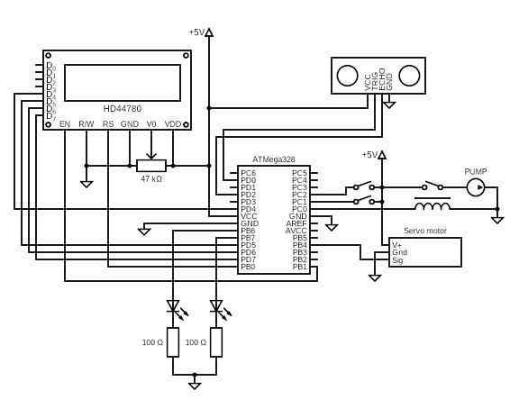

# DE2-Project
# Měření výšky vodní hladiny v nádrži

### Team members

* Czmelová Zuzana
* Shelemba Pavlo
* Točený Ivo
* Tomešek Jiří

Link to this file in your GitHub repository:

https://github.com/xtomes07/DE2-Project

### Table of contents

* [Project objectives](#objectives)
* [Hardware description](#hardware)
* [Libraries description](#libs)
* [Main application](#main)
* [Video](#video)
* [References](#references)

<a name="objectives"></a>

## Project objectives

Cílem projektu je pomocí arduina a programovacího jazyka C realizovat ovládání nádrže s kontrolou vodní hladiny. Pro snímání vodní hladiny byl vybrán ultrazvukový senzor HC-SR04, díky kterému je možné přesně zjistit výšku hladiny vody v nádrži na základě doby, za kterou ultrazvukový signál dorazí k vodní hladině a zpět k senzoru. Stav hladainy se následně bude zobrazovat na dipleji Hd44780 v kolonce LVL a pomocí animace stavu hladiny nádrže. Jako příslušenství k nádrži byl zvolen ventil pro vypouštění vody samospádem a čerpadlo pro napouštění. K ventilu bude připojen servo motor, který ventil ovládá. Ventil bude pracovat automaticky na základě vodní hladiny, když byl hrozilo přetečení nádrže, ventil se na základě povelu z arduina otevře a odpustí vodu. Lze ho také ovládat manuálně pomocí tlačítka. Čerpadlo bude ovládano pouze ručně přes tlačítko, které bude dávat povel arduinu a arduino na základě programu spíná relé, které spíná čerpadlo. Program zároveň bude vyhodnocovat stav hladiny a v případě, že by při čerpání vody do nádrže hrozilo přetečení nádrže, tak čerpadlo automaticky vypne. Stavy On/Off čepadla (PMP )a Open/Close ventilu (VLV) budou zobrazovány také na displeji Hd44780. K arduinu budou také připojeny dvě pomocné signalizační led diody. Zelená dioda bude svítit, když je nádrž plná vody a blikat když bude čerpadlo čerpat vodu do nádrže. Červená led dioda bude svítit, když je nádrž prázdná a svítit, když odpouštěcí ventil otevřený.

<a name="hardware"></a>

## Hardware description

- Arduino UNO
- Ultrazvukový senzor HC-SR04
- LCD displej Hd44780
- Relé pro ovládání čerpadla
- Servo motor pro ovládání ventilu
- Čerpadlo (v SimulID ho představuje DC motor)
- Dva spínače pro manuální ovladání čerpadla a ventilu
- Zelená a červená LED dioda pro pomocnou signalizaci stavu

### Arduino UNO

[Datasheet](https://github.com/xtomes07/DE2-Project/blob/main/Docs/ATmega48A-PA-88A-PA-168A-PA-328-P-DS.pdf)


### Ultrazvukový senzor HC-SR04

[Datasheet](https://github.com/xtomes07/DE2-Project/blob/main/Docs/HC-SR04.pdf)


HC-SR04 je ultrazvukový snímač vzdálenosti od 2 cm do 400 cm. Dosahuje přesnosti měření až +- 3 mm. Princi fungování spočí v tom, že pomocí arduina aktivujeme signál "TRIG" na měřiči vzdálenosti a to na dobu minimálně 10 μs. Následně vyšle modul ultrazvukový signál a čeká na jeho odražení od překážky a zpětné zachycení měřičem. Mezi tím se aktivuje signál "ECHO", jehož délka je pak úměrná vzdálenosti od překážky. Signál "ECHO" se deaktivuje po zachycení odraženého signálu měřičem vzdálenosti.

### LCD displej Hd44780

[Datasheet](https://github.com/xtomes07/DE2-Project/blob/main/Docs/HD44780.pdf)


HD44780 je alfanumerický LCD displej s řadičem. Má 2 řádky s 16 znaky na řádek.

### Relé


Parametry použitého relé závisí na připojeném čerpadle. V tomto případě bylo použito relé 30 VDC 10A, ,které je v klidovém stavu rozpojeno a dostačuje pro ovládání malého 12 V DC čerpadla.

### Servo motor pro ovládání ventilu

[Datasheet](https://github.com/xtomes07/DE2-Project/blob/main/Docs/SG90.pdf)


Servo motor SG90 s nylonovými převody se může otáčet o 360° a funguje podobně jako motorek s převodovkou, kde můžete jednoduše měnit rychlost a směr otáčení. Výhodou je, že pro ovládání nepotřebujete speciální motor driver, ale postačí jen PWM výstup přímo z řídící Arduino desky.


### Scháma zapojení obvodu:



K arduinu uno je přes piny D4 až D7, B1 a B0 připojen LCD displej Hd44780, na kterém se zobrazují aktuální informace o dění hardwaru a stavu hladiny vody v nádrži. Přes výstupní piny B6 a B7 jsou připojeny pomocné signalizační LED diody. Samotný ultrazvukový senzor HC-SR04 je připojen přes piny D0 a D2. Na pinu D0 je připojen Trig a na D2 je připojen pin Echo. Spínač pro manuální ovládání servo-motoru, který ovláda ventil, je na vstupním pinu C2 a spínač pro manuální ovládání čerpadla je na vstupním pinu C1. Ovládací signál pro servo-motor jde z výstupního pinu B4 a relé pro spínání čerpadla je připojeno na výstupní pin C0.

<a name="libs"></a>

## Libraries description

Projek se skládá z několika knihoven, které jsou napsány v jazyce C. Pro ovladaní displeje byly pouzity knihovny LCD.C, LCD.H a LCD_DEFINITION.H. Pro vstupní a výstupní obvody knihovny GPIO.C a GPIO.H. Pro ovladání časovače byla použita hnikovna TIMER.H. Všechny tyto knihovny byly vytvořeny v hodinách DE2. Dále byla vytvořena knihovna vlastních znaků SYMBOLS.H pro pomocné symboly stavu hladiny v nádrži. Pro řízení senzoru a následné čtení naměřených dat, byly vytvořeny vlastní knihovny ULTRASONIC.C a ULTRASONIC.H.

[GPIO.C](https://github.com/xtomes07/DE2-Project/blob/main/WaterTankController/WaterTankController/gpio.c)<br />
[GPIO.H](https://github.com/xtomes07/DE2-Project/blob/main/WaterTankController/WaterTankController/gpio.h)<br />
[LCD.C](https://github.com/xtomes07/DE2-Project/blob/main/WaterTankController/WaterTankController/lcd.c)<br />
[LCD.H](https://github.com/xtomes07/DE2-Project/blob/main/WaterTankController/WaterTankController/lcd.h)<br />
[LCD_DEFINITIONS.H](https://github.com/xtomes07/DE2-Project/blob/main/WaterTankController/WaterTankController/lcd_definitions.h)<br />
[TIMER.H](https://github.com/xtomes07/DE2-Project/blob/main/WaterTankController/WaterTankController/timer.h)<br />
[SYMBOLS.H](https://github.com/xtomes07/DE2-Project/blob/main/WaterTankController/WaterTankController/symbols.h)<br />
[ULTRASONIC.H](https://github.com/xtomes07/DE2-Project/blob/main/WaterTankController/WaterTankController/ultrasonic.h)<br />
[ULTRASONIC.C](https://github.com/xtomes07/DE2-Project/blob/main/WaterTankController/WaterTankController/ultrasonic.h)<br />


#### `symbols.h`

Knihovna obsahuje 6 vlastních symbolů pro úroveň hladiny vody v nádrži. Příklad jednoho symbolu z knihovny.

```c          
uint16_t customChar[] = {
    // Tank is empty
    0B10001,    
    0B10001,
    0B10001,
    0B10001,
    0B10001,
    0B10001,
    0B11111,
    0B11111,
```

#### `ultrasonic.c`

Tato knihovna byla vytvořena pro ultrazvukový senzor HC-SR04. Obsahuje funkce jako `ultrasonic_init` , která konfiguruje piny a Timer/Counter1 pro použití s HC-SR04. `ultrasonic_trigger` pro vyslání "TRIG" 10 μs impulzu  , `ultrasonic_start_measuring` a `ultrasonic_stop_measuring` pro zaznamenání doby, za jak dlouho se impulz vrátím `ultrasonic_get_distance` pro návratovou hodnotu vzdálenosti.

Ukázka kódu z funkce `ultrasonic_init`
```c          
void ultrasonic_init(volatile uint8_t *trig_reg, uint8_t trig_pin, volatile uint8_t *echo_reg, uint8_t echo_pin)
{
    signal_pin = echo_pin;

    // Configure trigger pin Data Direction Register as output
    *trig_reg |= (1<<trig_pin);
    // Move pointer to address of Port Register
    ++trig_reg;
    // Drive port pin low
    *trig_reg &= ~(1<<trig_pin);

    // Configure echo signal pin Data Direction Register as input
    *echo_reg &= ~(1<<signal_pin);
    // Move pointer to address of Port Register
    ++echo_reg;
    // Enable pull-up resistor
    *echo_reg |= (1<<signal_pin);
    // Move pointer back to address of Data Direction Register
    --echo_reg;
    
    if (*echo_reg == DDRB) {
        // Any change on any enabled PCINT[7:0] pin will cause an interrupt
        PCICR |= (1<<PCIE0);
        // Enable pin change interrupt on the corresponding I/O pin
        PCMSK0 |= (1<<signal_pin);
    }
    if (*echo_reg == DDRC) {
        PCICR |= (1<<PCIE1);
        PCMSK1 |= (1<<signal_pin);
    }
    if (*echo_reg == DDRD) {
        if (signal_pin == PIN_INT1) {
            // Rising edge on INT1 generates an interrupt request
            EICRA |= (1<<ISC11) | (1<<ISC10);
            // Enable External Interrupt Requests
            EIMSK |= (1<<INT1);
        }
        else if (signal_pin == PIN_INT0) {
            // Rising edge on INT0 generates an interrupt request
            EICRA |= (1<<ISC01) | (1<<ISC00);
            // Enable External Interrupt Requests
            EIMSK |= (1<<INT0);
        }
        else {
            PCICR |= (1<<PCIE2);
            PCMSK2 |= (1<<signal_pin);
        }
    }

    // 340 m/s sound wave propagates by 1 cm in ~58,8235 us
    // Empirical measurement suggests that 930 clocks of TIM1
    // with prescaler N=1 takes almost the same amount of time
    // Set max TIM1 value to this clock number
    OCR1A = 930;
    // Enable Timer/Counter1 Output Compare A Match interrupt
    TIMSK1 |= (1<<OCIE1A);
    // Enable Timer/Counter1 Clear Timer on Compare Match mode
    TCCR1B |= (1<<WGM12);
}
```


<a name="main"></a>

## Main application


Hlavním účelem této aplikace je automatizace provozu regulace hladiny vody ve vodní nádrži. Hladina vody je snímána pomocí ultrazvukového senzoru, který je připojen k desce Arduino Uno. LCD displej zobrazuje hladinu vody v nádrži pomocí procent a vlastních znaků v prvním řádku displeje. Při určitých stavech se místo procent zobrazují textové informace jako EMPTY, FULL a OVERFLOW. Ve druhém řádku jsou vypsány informace o hardwaru. Jestli je vypouštěcí ventil (VLV) otevřen nebo zavřen a také jestli čerpadlo (PMP) čerpá vodu do nádrže nebo je vypnuto. Aplikace hlída vodní hladinu, při hrozbě přetečení nádrže, dojde k otevření výpustného ventilu pomocí servo-motoru, který přebytečnou vodu odpustí. Ventil lze ovládat i manuálně pomocí přepínače. Čerpadlo je ovládáno manuálně pomocí přepínače a plní nádrž vodou. V případě, že by hrozilo přečerpání a následné přetečení nádrže, aplikace to vyhodnotí a čerpadlo vypne i v případě seplého spínače pro manuální ovládání čerpadla. K arduinu jsou připojeny pomocné indikační LED diody. Červená dioda svítí, když je nádrž plná a bliká když je v provozu čerpadlo. Modrá dioda Svítí v případě prázdné nádrže a bliká, když je otevřený vypouštěcí ventil.


<a name="video"></a>

## Video


<a name="references"></a>

## References

1. Write your text here.
