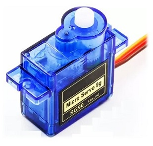

# DE2-Project
# Měření výšky vodní hladiny v nádrži

### Team members

* Czmelová Zuzana
* Shelemba Pavlo
* Točený Ivo
* Tomešek Jiří

Link to this file in your GitHub repository:

https://github.com/xtomes07/DE2-Project

### Table of contents

* [Project objectives](#objectives)
* [Hardware description](#hardware)
* [Libraries description](#libs)
* [Main application](#main)
* [Video](#video)
* [References](#references)

## Project objectives

Cílem projektu je pomocí arduina a programovacího jazyka C realizovat ovládání nádrže s kontrolou vodní hladiny. Pro snímání vodní hladiny byl vybrán ultrazvukový senzor HC-SR04, díky kterému je možné přesně zjistit výšku hladiny vody v nádrži na základě doby, za kterou ultrazvukový signál dorazí k vodní hladině a zpět k senzoru. Stav hladainy se následně bude zobrazovat na dipleji Hd44780 v kolonce LVL a pomocí animace stavu hladiny nádrže. Jako příslušenství k nádrži byl zvolen ventil pro vypouštění vody samospádem a čerpadlo pro napouštění. K ventilu bude připojen servo motor, který ventil ovládá. Ventil bude pracovat automaticky na základě vodní hladiny, když byl hrozilo přetečení nádrže, ventil se na základě povelu z arduina otevře a odpustí vodu. Lze ho také ovládat manuálně pomocí tlačítka. Čerpadlo bude ovládano pouze ručně přes tlačítko, které bude dávat povel arduinu a arduino na základě programu spíná relé, které spíná čerpadlo. Program zároveň bude vyhodnocovat stav hladiny a v případě, že by při čerpání vody do nádrže hrozilo přetečení nádrže, tak čerpadlo automaticky vypne. Stavy On/Off čepadla (PMP )a Open/Close ventilu (VLV) budou zobrazovány také na displeji Hd44780. K arduinu budou také připojeny dvě pomocné signalizační led diody. Zelená dioda bude svítit, když je nádrž plná vody a blikat když bude čerpadlo čerpat vodu do nádrže. Červená led dioda bude svítit, když je nádrž prázdná a svítit, když odpouštěcí ventil otevřený.

## Hardware description

- Arduino UNO
- Ultrazvukový senzor HC-SR04
- LCD displej Hd44780
- Relé pro ovládání čerpadla
- Servo motor pro ovládání ventilu
- Čerpadlo (v SimulID ho představuje DC motor)
- Dva spínače pro manuální ovladání čerpadla a ventilu
- Zelená a červená LED dioda pro pomocnou signalizaci stavu

### Arduino UNO

[Datasheet](https://github.com/xtomes07/DE2-Project/blob/main/Docs/ATmega48A-PA-88A-PA-168A-PA-328-P-DS.pdf)

### Ultrazvukový senzor HC-SR04

[Datasheet](https://github.com/xtomes07/DE2-Project/blob/main/Docs/HC-SR04.pdf)

### LCD displej Hd44780

[Datasheet](https://github.com/xtomes07/DE2-Project/blob/main/Docs/HD44780.pdf)

### Relé

### Servo motor pro ovládání ventilu

[Datasheet](https://github.com/xtomes07/DE2-Project/blob/main/Docs/SG90.pdf)

### Scháma zapojení obvodu:

K arduinu uno je přes piny D4 až D7, B1 a B0 připojen LCD displej Hd44780, na kterém se zobrazují aktuální informace o dění a stavu hladiny. Přes piny B6 a B7 jsou připojeny pomocné signalizační LED diody. Samotný senzor HC-SR04 je připojen přes piny D0 a D2. Na pinu D0 je připojen Trig a na D2 je připojen pin Echo. Spínač pro manuální ovládání servo-motoru, který ovláda ventil, je na vstupním pinu C2 a spínač pro manuální ovládání čerpadla je na pinu C1. Ovládací signál pro servo-motor jde u výstupního pinu B4 a relé pro spínání čerpadla je připojeno na výstupní pin C0.

## Libraries description

Projek se skládá z několika knihoven, které jsou napsány v jazyce C. Pro ovladaní displeje byly pouzity knihovny LCD.C, LCD.H a LCD_DEFINITION.H. Pro vstupní a výstupní obvody knihovny GPIO.C a GPIO.H. Pro ovladání časovače byla použita hnikovna TIMER.H. Všechny tyto knihovny byly vytvořeny v hodinách DE2. Dále byla vytvořena knihovna vlastních znaků SYMBOLS.H pro pomocné symboly stavu hladiny v nádrži. Pro řízení senzoru a následné čtení naměřených dat, byly vytvořeny knihovny ULTRASONIC.C a ULTRASONIC.H.

[GPIO.C](https://github.com/xtomes07/DE2-Project/blob/main/WaterTankController/WaterTankController/gpio.c)

[GPIO.H](https://github.com/xtomes07/DE2-Project/blob/main/WaterTankController/WaterTankController/gpio.h)

[LCD.C](https://github.com/xtomes07/DE2-Project/blob/main/WaterTankController/WaterTankController/lcd.c)

[LCD.H](https://github.com/xtomes07/DE2-Project/blob/main/WaterTankController/WaterTankController/lcd.h)

[LCD_DEFINITIONS.H](https://github.com/xtomes07/DE2-Project/blob/main/WaterTankController/WaterTankController/lcd_definitions.h)

[TIMER.H](https://github.com/xtomes07/DE2-Project/blob/main/WaterTankController/WaterTankController/timer.h)

[SYMBOLS.H](https://github.com/xtomes07/DE2-Project/blob/main/WaterTankController/WaterTankController/symbols.h)

[ULTRASONIC.H](https://github.com/xtomes07/DE2-Project/blob/main/WaterTankController/WaterTankController/ultrasonic.h)

[ULTRASONIC.C](https://github.com/xtomes07/DE2-Project/blob/main/WaterTankController/WaterTankController/ultrasonic.h)

## Main application

Write your text here.

## Video

## References

1. Write your text here.
